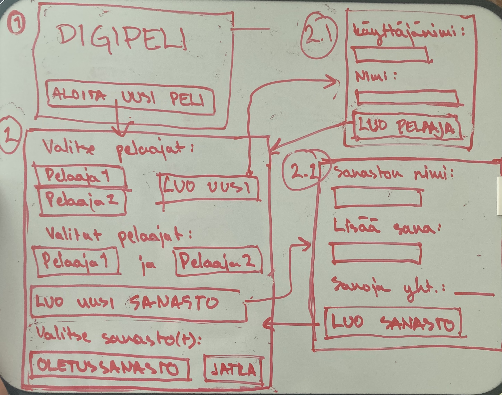
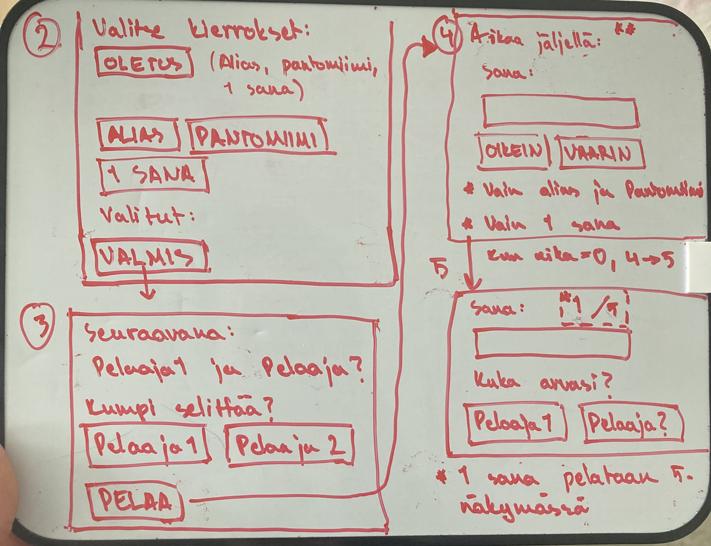

# Vaatimusmäärittely

## Sovelluksen tarkoitus

Sovelluksen tarkoituksena on luoda digitaalinen versio Peli nimisestä pelistä. Peliä voidaan pelata kahdella pelaajalla, mutta suositeltava pelaajamäärä on 4+. Peliä on tarkoitus pelata pareittain. 

Peli muistuttaa kaikille tuttua Alias-peliä. Eroja Aliakseen kuitenkin on:
- Selitettävät sanat voidaan keksiä itse
- Kierroksia on kolmenlaisia:
-- 1. Sanoja selitetään Aliaksen tapaan käyttämättä sanaa tai sen osaa. Kierroksen aikaraja on 1 min.
-- 2. Sana selitetään pantomiimilla. Kierroksen aikaraja on 1 min.
-- 3. Sana selitetään yhdellä sanalla, ja kaikki saavat arvata. Kierros jatkuu, kunnes 5 sanaa on selitetty.

Yhdestä arvauksesta saa pisteen yhden pisteen. Eniten pisteitä kerännyt voittaa pelin.

## Käyttäjäprofiilit (tehty)

Jokainen pelaaja luo itselleen oman profiilin, joka kirjoitetaan talteen myöhempää käyttöä varten.

## Sanastotietokanta (tehty, ei toimi)

Pelin mukana tulee tietokanta, joka sisältää 50 sanan sanalistan. Sanastotietokantaan voi lisätä omia listoja (ja se juuri onkin pelin tarkoitus)

## Käyttöliittymäluonnos

Sovellus koostuu viidestä (ehkä kuudesta) näkymästä. Näkymät ovat numerojärjestyksessä:
- 1. Aloitusnäkymä 
- 2. Valmistelunäkymä
- 3. Valmiusnäkymä
- 4. Pelinäkymä
- 5. Yhteenvetonäkymä

## Sovelluksen toiminta

Sovellus aukeaa aloitusnäkymään (1). Tästä näkymästä voidaan aloittaa pelivalmistelut painamalla "ALOITA UUSI PELI".
Aloitusnäkymästä päästään valmistelunäkymään (2). Näkymässä voidaan valita pelaajat, jotka osallistuvat peliin. Pelaajat tulee valita pareittain. Valitut pelaajat listataan pareittain kohdan "Valitut pelaajat:" alle.
Jos halutaan luoda uusi pelaaja, siirrytään pelaajanluontinäkymään (2.1) painamalla "LUO UUSI PELAAJA". Pelaajalla tulee olla käyttäjänimi. Pelaaja voi myös liittää oman nimensä käyttäjään. Painamalla "LUO PELAAJA" palataan takaisin valmistelunäkymään (2).
Painamalla "LUO UUSI SANASTO" valmistelunäkymässä (2) siirrytään sanaston luonti -näkymään (2.2). Sanastolle tulee antaa nimi. Tämän jälkeen sanastoon voi lisätä sanoja. "Sanoja yhteensä:"-kohdan perässä oleva luku kertoo, montako sanaa sanastossa on. Painamalla "LUO SANASTO"-siirrytään takaisin valmistelunäkymään (2).
Kohdasta "Valitse sanasto(t):" voidaan valita, mitä sanastoa halutaan käyttää. Kun valinnat on tehty, päästään valmiusnäkymään (3) painamalla "VALMIS".
Valmiusnäkymässä (3) lukee, mikä joukkue on vuorossa seuraavaksi. Joukkue voi tässä vaiheessa valita, kumpi selittää. Kun päätös on tehty, siirrytään pelinäkymään (4) painamalla "PELAA"-nappia.
Pelinäkymässä lukee paljonko aikaa on jäljellä, selitettävä sana ja vaihtoehdot "OIKEIN" ja "VÄÄRIN". "OIKEIN" lisää joukkueelle yhden pisteen ja antaa seuraavan sanan ja "VÄÄRIN" antaa vain seuraavan sanan.

Toiminnallisuudet ajatusviivoin:
- Uuden pelaajan luominen
-- ja lisääminen pelaajat-tietokantaan
-- pelaajalla on nimimerkki, nimi (vapaaehtoinen), luomispäivä ja aika, voittojen lukumäärä (uudella pelaajalla 0)
- Uuden sanaston luominen
-- ja lisääminen sanastot-tietokantaan
- Olemassaolevasta sanastosta pelaajien lukumäärälle sopivan sanaston arpominen
- Kirjanpito joukkueiden pisteistä

## Jatkokehitys

- Tilastojen graafinen esitys
- Erilaiset pelimoodit
-- Uusia pelimoodeja
- Eri kokoisten joukkueiden muodostaminen
- Diplomin generoiminen voittajajoukkueelle
