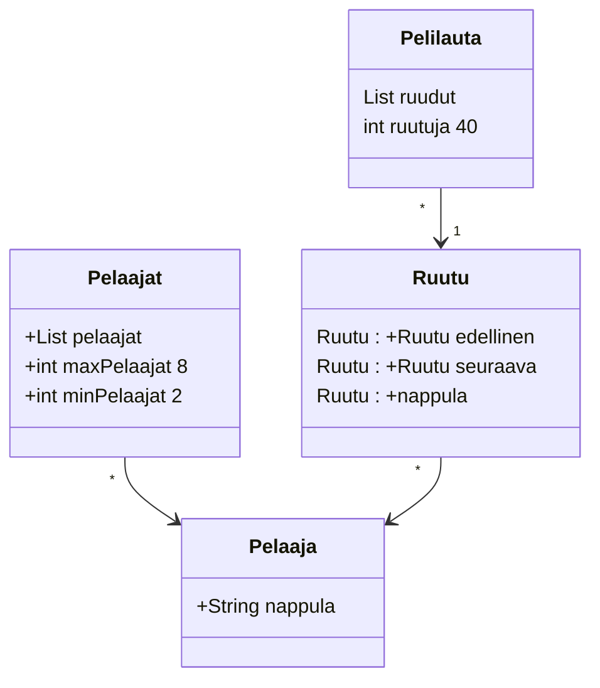

# Monopoli

## Luokkakaavio

```mermaid
classDiagram
    Pelilauta "*" --> "1" Ruutu
    Pelaajat "*" --> Pelaaja
    Ruutu "*" --> Pelaaja
        

    Pelilauta : List<Ruutu> ruudut
    Pelilauta : int ruutuja 40 
    
    class Ruutu{
    Ruutu : +Ruutu edellinen
    Ruutu : +Ruutu seuraava
    Ruutu : +nappula
    }
    class Pelaajat{
        +List<Pelaaja> pelaajat
        +int maxPelaajat 8
        +int minPelaajat 2
    }
    class Pelaaja{
        +String nappula
    }
```
    	
