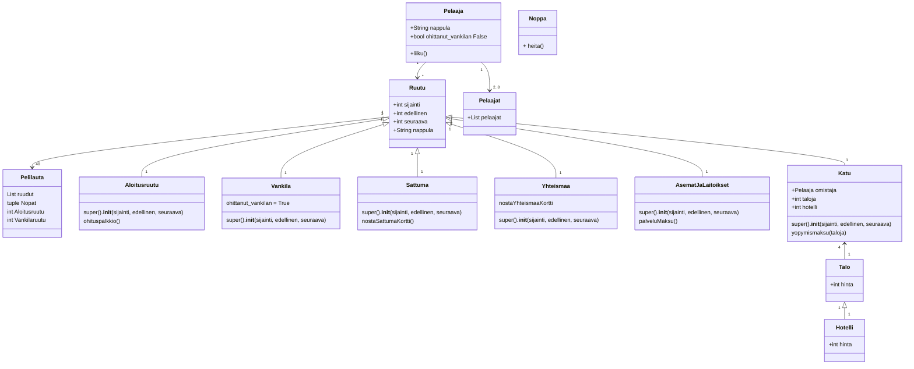

# Monopoli

## Luokkakaavio

```mermaid
classDiagram
    Ruutu "1" --> "40" Pelilauta
    Pelaaja "1" --> "2..8" Pelaajat
    Pelaaja "1" --> "*" Ruutu
    Ruutu "1" <|-- "1" Aloitusruutu
    Ruutu "1" <|-- "1" Vankila
    Ruutu "1" <|-- "1" Sattuma
    Ruutu "1" <|-- "1" Yhteismaa
    Ruutu "1" <|-- "1" AsematJaLaitoikset  
    Ruutu "1" <|-- "1" Katu 
    Katu "4" <-- "1" Talo
    Talo "1" <|-- "1" Hotelli
    
    Pelilauta : List<Ruutu> ruudut 
    Pelilauta : tuple<Noppa, Noppa> Nopat
    Pelilauta : int Aloitusruutu
    Pelilauta : int Vankilaruutu
    
    class Noppa{
    + heita()
    }
    class Ruutu{
    +int sijainti
    +int edellinen
    +int seuraava
    +String nappula
    }
    class Aloitusruutu{
    super().__init__(sijainti, edellinen, seuraava)
    ohituspalkkio()
    }
    class Vankila{
    super().__init__(sijainti, edellinen, seuraava)
    ohittanut_vankilan = True
    }
    class Sattuma{
    super().__init__(sijainti, edellinen, seuraava)
    nostaSattumaKortti()
    }
    class Yhteismaa{
    super().__init__(sijainti, edellinen, seuraava)
    nostaYhteismaaKortti
    }
    class AsematJaLaitoikset{
    super().__init__(sijainti, edellinen, seuraava)
    palveluMaksu()
    }
    class Katu{
    super().__init__(sijainti, edellinen, seuraava)
    +Pelaaja omistaja
    +int taloja 
    +int hotelli
    yopymismaksu(taloja)
    }
    class Pelaajat{
        +List<Pelaaja> pelaajat 
    }
    class Pelaaja{
        +String nappula
        +bool ohittanut_vankilan False
        +liiku()
    }
    class Talo{
    +int hinta
    }
    class Hotelli{
    +int hinta
    }
```
    	
