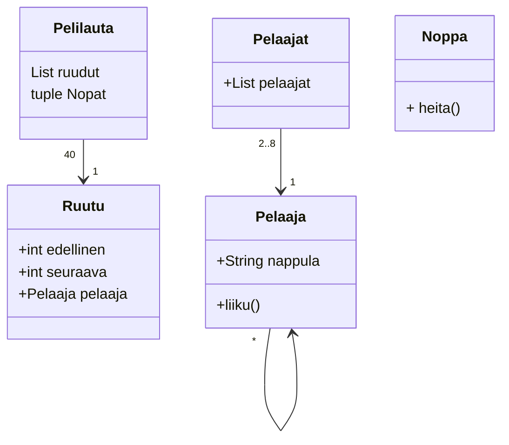

# Monopoli

## Luokkakaavio

```mermaid
classDiagram
    Pelilauta "40" --> "1" Ruutu
    Pelaajat "2..8" --> "1" Pelaaja
    
    Pelaaja "*" --> Pelaaja

    Pelilauta : List<Ruutu> ruudut 
    Pelilauta : tuple<Noppa, Noppa> Nopat
    
    class Noppa{
    + heita()
    }
    class Ruutu{
    +int edellinen
    +int seuraava
    +Pelaaja pelaaja
    }
    class Pelaajat{
        +List<Pelaaja> pelaajat 
    }
    class Pelaaja{
        +String nappula
        +liiku()
    }
```
    	
